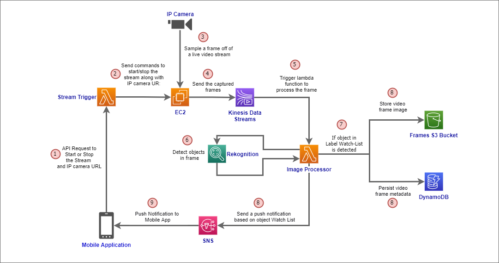
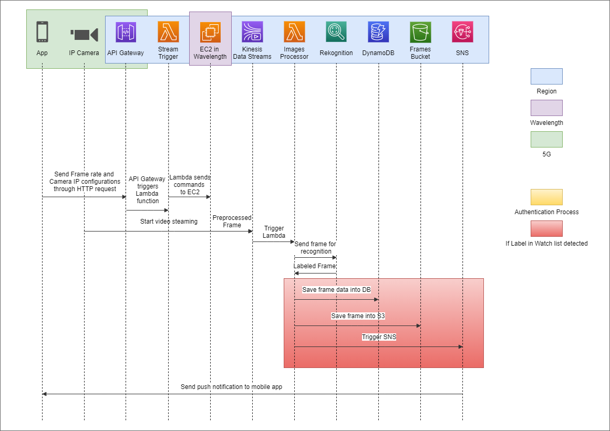

# Near wild life

## Inspiration

Technology can play a vital role in human life.

While Saving humans' lives stand as the noblest target, throughout the last years, we observed many wild animal attacks that could have been mitigated if, and only if, people were alerted.

We want to utilize technology to bring that alert that can save human lives.

This is our inspiration

## What it does

The application provides a solution for personal safety with multiple flavors such as Beach Sharks alert, Wild Animals attack, and other safety use cases.

Target Customers will be Consumers, Government entities, & nature reserves.

The initial version relies on a Mobile application plus a 360-smart cam with 5G SIM that can also achieve Connectivity via Hotspot offered by a 5G Capable UE.

Families and individuals can turn on the cam during camping or hiking near the wild. The Camera is continually sending the Live Video to Backend systems hosted on Verizon/AWS Wavelength. The video is analyzed using AI Engines to identify danger (e.g., Coyotes), and an alert is sent to the user Via the Mobile App.

## How we built it

### Introduction

Consider the ability to capture live video streams, identify objects using deep learning, and then trigger actions or notifications based on the identified objects – all with low latency and without the need for a single server to manage. This is precisely what this project will assist in accomplishing with AWS. A live video capture, analysis, and alerting solution prototype will be set up and executed.

The use case capitalizes on 5G high uplink throughput for the Camera video frames transmission and Edge low latency for video analytics and alerting users in the lowest achievable latency.

AWS/Verizon Wavelength will be the Edge DC hosting Video Analytics and ML-based applications skipping sending the video frames to Core DC across the Backhaul to avoid unnecessary Bandwidth Utilization.

As a summary, the prototype was designed to address Wild Animals detection/alerting based on a live video feed from an IP camera.

### High level perspective

The solution works on a high level as follows.

A camera monitors a specific area in Camp’s, streaming video to a video capture mobile application over the network. The client collects video frames and sends them to AWS, where they are analyzed and stored alongside metadata. Notifications are sent out if a Wild Animal is detected in the analyzed video frames.

### Technicalities

Since this was our first real exposure for all of us to AWS services. We started by searching for articles or projects that will help us to start ahead. And this led us to this [project](https://github.com/aws-samples/amazon-rekognition-video-analyzer) in [AWS-Samples](https://amazon.com/aws) account.

This GitHub project was our perfect head start. It mainly streams videos from IP cameras to AWS, recognize frames by Rekognition according to user-configured labeling list, and sends alerts using SNS.

Here below the GitHub project Flow Diagram:

But of course, it required modifications to fit our project idea. As seen in the below flow diagram.

We have changed/added the below:

1. The system is triggered from the mobile application; instead of being manually from local device.
2. Hosted the video capture client on EC2 instance that get triggered by a lambda function.
3. Added support for RTSP streams.
4. A push notification is sent to the mobile application. Instead of checking for updates regularly from a web UI.

## Challenges we ran into

- Wavelength connectivity while we’re outside US
- Building the mobile application, as we had no experience in app development
- Deploying the video capture client to EC2 instance, and connect it with lambda function
- Testing with a real camera and having natural scenes of animals constructed a challenging environment to reproduce.

## Accomplishments that we're proud of

- Building our first architecture in AWS
- Building a functioning mobile application that gets the job done
- Completing the prototype of a solution that save human lives utilizing latest technologies such as 5G.

## What we learned

- 5G Architecture, Characteristics, & Call Flows in addition to 5G Verizon Connectivity to AWS Wavelength.
- There are different protocols for video streaming
- Flutter for App development
- Push Notification has different providers like FCM and APNs. It has large number of parameters that control the behavior of when and where it is being received.
- Amazon Rekognition has a large set of label types that almost cover every aspect.
- SNS can send to AWS services

## What's next for Near wild

- Productionize it by adding accounts and authentication support
- Alert customers based on their geo-location (ex: bear detected near-by)
- Alerting customers by sending sound alerts generated by Amazon Alex.
- Support a wide range of cameras.
- Add support to stream the camera within the App
- Intensive testing for all possible environment conditions.